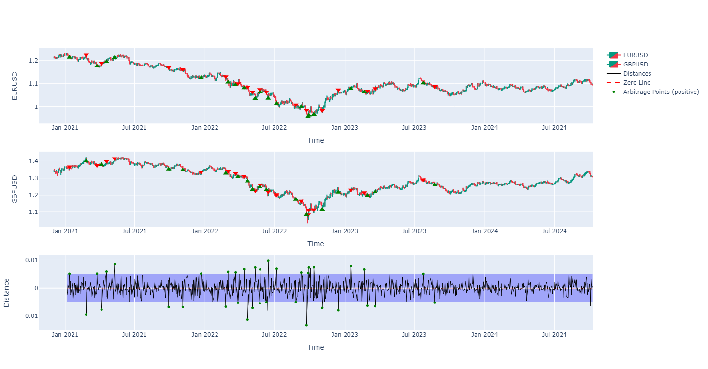

# Statistical Pair-Arbitrage Project

This project uses statistical methods to identify arbitrage opportunities in a pair of assets that are expected to behave in a similar manner. For instance EURUSD and GBPUSD are expected to have a high correlation and thus a pair of assets that can be used to identify arbitrage opportunities. The project uses the following steps to identify arbitrage opportunities:
1. Data Collection - Collect historical data for the pair of assets for a given time period using MT5 API or yfinance API.
2. Preprocessing Data - Preprocess the data and create a dataframe with all the necessary columns.
3. Linear Regression - Perform linear regreesion on the data to identify the relationship between the two assets.
4. Visualize Data - Visualize the data using Plotly and show the opportunities for arbitrage on the candlestick chart.

## Data Collection
The data is collected using the MT5 API or yfinance API. The data is collected for a given time period and stored in a dataframe. The columns that are stored are time, open, high, low, close.
```python
data0_raw = fns.GetPriceData(symbol[0], endTime, timeframe, Nbars+LoopbackBars)
data1_raw = fns.GetPriceData(symbol[1], endTime, timeframe, Nbars+LoopbackBars)
```

## Preprocessing Data
Both the dataframes are preprocessed and the data is joined in one single dataframe. 
```python
data = data0.join(data1)
```

## Linear Regression
The log return values are used to perform linear regression on the data. A loopback period is used to calculate the log returns for the given time period.
```python
line = [np.polyfit(data['log_return_0'][i:i+LoopbackBars], data['log_return_1'][i:i+LoopbackBars], 1) for i in range(1,Nbars)]
```
Slope, intercept and r_value are calculated for the linear regression.
```python
slope = np.array([l[0] for l in line])
intercept = np.array([l[1] for l in line])
r2 = [np.corrcoef(data['log_return_0'][i:i+LoopbackBars], data['log_return_1'][i:i+LoopbackBars])[0, 1] ** 2 for i in range(1,Nbars)]
```
Next the **perpendicular** distance is calculated for each data point from the line.
```python
x = data['log_return_0']
y = data['log_return_1']
a = data['slope']
b = data['intercept']

distances = -(a * x - y + b) / np.sqrt(a**2 + 1)

data['distance'][LoopbackBars+1:] = distances[LoopbackBars+1:]
```
The code that calculates the perpendiculr distance might seem a bit confusing. The formula to find the perpendicular distance of a point `(x0, y0)` from a line `y = ax + b` is given by:
$$
\text{distance} = -\frac{ax_0 - y_0 + b}{\sqrt{a^2 + 1}}
$$
Then the sign of the distance is calculated by checking if the point is above or below the line. 

A simpler approach would be to calculate the distance between the point `(x0, y0)` and the line `y = ax + b` using the formula:
$$
\text{distance} = y_0 - (ax_0 + b)
$$
This formula calculates the distance between the point and the line in the y-direction (not the perpendicular distance). 

The distance (`data['distance']`) is then used to identify the arbitrage opportunities. When distance is greater than a certain threshold, it is considered as an arbitrage opportunity.

Also, zero-crossing rate can be calculated for the distance line.
```python
zero_crossings = np.sum(np.diff(np.sign(data['distance'][LoopbackBars+1:])) != 0)
zcr = zero_crossings / (sum(~np.isnan(data['distance'])) - 1) 
```

## Visualize Data
The candlesticks for both pairs are visualized using Plotly. A user-defined function is used to identify the points when the distance is greater than a certain threshold followed by a distance that has crossed the zero-line or is closer to the zero-line than the previous point. These points are considered as arbitrage opportunities and are labelled on the chart.

## MQL5 Integration
This project is integrated within MQL5 as an EA. The EA can be used to identify arbitrage opportunities in real-time (or historical data) and can be used to place trades automatically. The EA is more sophisticated in the sense that it can be mixed with other strategies easily. For instance, one can select only the London session to trade or only when the ADX is above a certain threshold. The EA can be used to trade both pairs at the same time. 

The MQL5 integration is also more sophisticated when it comes to tick-level backtesting. It can use tick-data to backtest the strategy unlike yfinance and MT5 API in python that only provide OHLC data in a given timeframe. 

## Next Steps
The strategy at this stage is not really profitable the way it is. The main reason is that when the distance is greater than a certain threshold, the strategy opens opposite trades on both pairs. Most of the time, the distance comes back to zero (or even crosses the zero-line) in the next few bars. But it does not neccearily mean that both opened trades will be profitable. Mostly, one of the trades will be profitable and the other will be a loss. So the next step is to identify which trade (which asset) is more likely to be profitable and move in the expected direction in the next few candles. That is the main challenge and the next step in this project. 